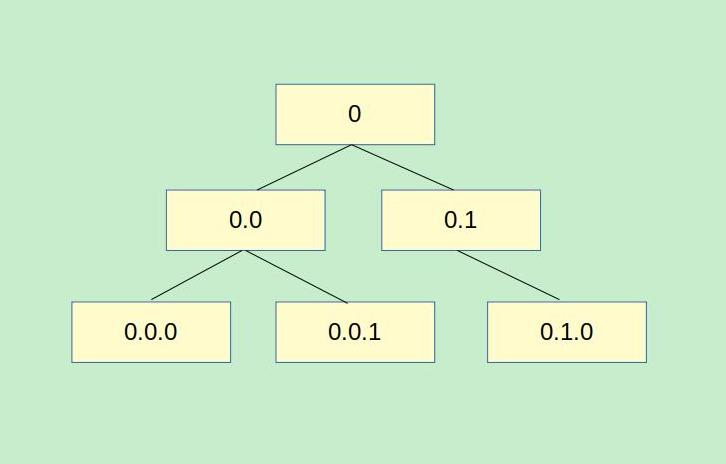

## 手写 react 核心源码

手写 React 源码分为以下几个部分：

1. 虚拟 DOM
2. 组件的渲染
3. DOM－diff 算法

### VirtualDOM 实现

React 中为了提高 DOM 的操作效率提出了虚拟 DOM（Virtual DOM），其实本质就是一个 Javascript 对象，在我们使用 React 操作 DOM 时，首先通过虚拟 DOM 来做比较，将有差异的虚拟结点更新，再反应到真实的 DOM 结构上，这样就提高了效率。


一个虚拟 DOM 具有以下三个属性：

- type 元素类型
- props 元素属性
- chlidren 子元素（数组类型）

在 React 中创建一个 VirtualDOM 是通过内部的 createElement 函数来实现的。我们在使用 React 来书写 JSX 时，实际上是 createElement 函数的一个语法糖，使用 Babel 进行编译时会通过 AST 来将我们的 JSX 语法转为 React 可识别的 createElement 语法。

我们可以在线使用[Babel 编译器](https://www.babeljs.cn/repl/#?babili=false&browsers=&build=&builtIns=false&code_lz=DwEwlgbgfAEgpgGwQewAQCU4EMDGAXAOmAHpxog&debug=false&forceAllTransforms=false&shippedProposals=false&circleciRepo=&evaluate=false&fileSize=false&lineWrap=true&presets=es2015%2Creact%2Cstage-2&prettier=false&targets=&version=6.26.0&envVersion=)来查看 jsx 在语法转化的过程。当我们创建一个普通的 HTML 元素：

```html
<div className="txt">Hello React.</div>
```

经过编译会由 babel 编译为以下代码：

```js
React.createElement("div", { className: "txt" }, "Hello React.");
```

可以看到，第 1 个参数即元素的类型，以上是一个 div 标签；第 2 个参数即属性对象，React 将其转为一个对象形式；而第 3 个参数即子元素，当前只是一段文本。

因此我们定义一个类来模拟 VirtualDOM：

```js
class Element {
  constructor(type, props, ...children) {
    this.type = type; //类型
    this.props = props; //属性
    this.children = children; //子元素
  }
}
```

而创建 virtualDOM 的核心方法是 createElement：

```js
function createElement(type, props, ...children) {
  if (children.length === 0) {
    return new Element(type, props);
  } else {
    let subElements = [];

    for (let i = 0; i < children.length; i++) {
      if (typeof children[i] === "string") {
        subElements.push(children[i]);
      } else {
        //若子元素仍是一个对象， 则递归
        subElements.push(
          createElement(
            children[i].type,
            children[i].props,
            ...children[i].children
          )
        );
      }
    }
    return new Element(type, props, ...subElements);
  }
}
```

这样，当我们使用 createElement 来创建多层级的元素时，也可正确返回虚拟 DOM：

```js
const vDom = createElement(
  "div",
  {
    style: "border:5px solid green"
  },
  createElement("button", { id: "btn1", onClick: test }, "OK1"),
  createElement("button", { id: "btn2", onClick: test }, "OK2"),
  createElement("button", { id: "btn3", onClick: test }, "OK3")
);
```

### render 实现

在使用 render 方法来渲染为真实的 HTMLDOM 时，有 3 种情况：

1. 元素就是一个文本或是数值
2. 元素是一个原生的 HTML DOM
3. 元素是一个虚拟结点 vDOM

当渲染的是一个普通文本结点时，React 会使用一个 span 标签来包裹，并用`data-reactid`属性为元素编号：

```html
<span data-reactid="0">Hello React</span>
```

编号从 0 开始计数，按元素的层级一层层的递增，它有一套规则，就是按深度先序遍历的顺序来编号，见下图：



_使用深度优先原则，对整个 DOM 树来进行编号的目的是方便 DOM-diff 算法来更新 DOM 树_

因此，我们在编写 React 源码时也要考虑到内部维护一个索引变量，来对渲染的元素编号。

由于情况较为复杂， 我们抽离出一个方法来处理：`createReactUnit()`。这个方法里面做好判断，对应以上 3 种情况来创建不同的 DOM。

`createReactUnit()` 方法不论传入的是何种类型的元素，它的返回值是一个封装好的**对象**，对象中有一个`getMarkup`方法，调用它则返回的是**HTML 原生 DOM**，它是可以直接插入到真实的 DOM 结点上（渲染为真正的 HTML）。

用法举例：

```js
let ReactDOM = {
  //维护DOM编号
  nextRootIndex: 0,
  /**
   * @description 将元素渲染到目标容器中
   * @param element 渲染的元素，可以是文本、原生DOM或vDOM
   * @param container 容器
   */
  render: function(element, container) {
    let unitInstance = createReactUnit(element);
    let markup = unitInstance.getMarkup(this.nextRootIndex); //markup即原生HTML DOM

    //插入到目标结点中
    container.appendChild(markup);
    $(document).trigger("mounted"); //将DOM挂载完成后，手动触发mounted事件
  }
};
```

下面就编写渲染的逻辑，我们为了方便扩展，首先定义一个 BaseUnit 基类，它里面只有一个虚方法 getMarkup 等待子类来重写。每一个子类都针对渲染的元素类型不同而重写 getMarkup 方法：

```js
/**
 * 渲染元素的基类
 */
class BaseUnit {
  constructor(element) {
    //当前元素，可能是文本、原生DOM或vDOM
    this._currentElement = element;
  }
  //等子类重写
  getMarkup(index) {}
}
/**
 * @description 文本元素
 */
class ReactTextUnit extends BaseUnit {
  getMarkup(index) {
    /*渲染文本元素的逻辑*/
  }
}
/**
 * @description 原生HTML DOM元素
 */
class ReactNativeUnit extends BaseUnit {
  getMarkup(index) {
    /*渲染原生HTML DOM的逻辑*/
  }
}
```

这样条理清楚，以后再次扩展，比如加一个渲染 VirtualDOM 的逻辑，再添加一个子类即可。

接下来就是实现普通文本元素的渲染：

```js
  /**
   * @description 渲染文本元素，子类重写父类的方法
   * @param {number} index DOM编号
   */
  getMarkup(index) {
    this._rootId = index;
    let span = document.createElement("span");
    span.setAttribute("data-reactid", this._rootId);//维护结点编号
    span.appendChild(document.createTextNode(this._currentElement));
    return span;
  }
```

渲染文本元素非常简单，只要创建一个 span 元素的 HTML 元素即可。注意不要忘记添加`data-reactid`属性，它由参数传入。

原生 HTMLDOM 的渲染有些许复杂，由于可能有子元素，这就需要递归操作：

```js
  getMarkup(index) {
    this._rootId = index;
    let { type, props, children } = this._currentElement;
    let tagName = type;
    let $dom = document.createElement(tagName);
    $dom.setAttribute("data-reactid", index);
    if (props) {
      //赋属性值
      Object.entries(props).forEach(([key, val]) => {
        if (/^on[A-Z]/.test(key)) {
          //若是以on开头的属性，以委托的方式绑定事件
          $(document).delegate(
            `[data-reactid="${this._rootId}"]`,
            key.slice(2).toLowerCase(),
            val
          );
        } else {
          $dom.setAttribute(key, val);
        }
      });
    }

    children = children || [];
    children.forEach((item, i) => {
      //递归子元素
      let subInstance = createReactUnit(item);
      $dom.appendChild(subInstance.getMarkup(`${this._rootId}.${i}`));
    });
```

根据传入的 type 参数来创建不同的 HTML 标签，之后就是赋值属性。

当用户为 vDOM 元素绑定了事件时要注意，为了简便我这里使用 jQuery 来处理事件的绑定，使用一个正则来查找以“on”为开头的属性名称，之后使用事件代理的方法为元素添加事件绑定。

若元素还有子元素则进行递归。直接再次调用 createReactUnit 即可，只要传入当前子元素，整个处理逻辑会再次执行，直到整个虚拟 DOM 树遍历完结束，注意要按照 React 的规则来维护结点编号，以“父级 id . 子级 id”的格式来传值。
